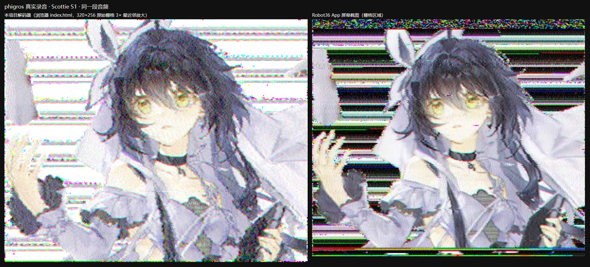

# 抗干扰 SSTV 解码平台

把一张图片变成一段声音发出去，对方用同一个网页把声音还原成图片。
**纯前端、零依赖**，双击 `index.html` 就能离线用，不需要安装任何东西。

声音在传输路上会被压缩、被重采样、混进噪声、被房间混响糊掉。这个项目专门解决这件事——
同样的音频，别的解码器读不出来的时候它还能读出来。


## 能做什么

- **四种模式**：Martin M1 / Scottie S1 / PD120 / PD180，都能编码也能解码
- **抗干扰**：频率失谐、音质损伤、采样率不匹配、环境噪声与混响
- **两种用法**：浏览器里直接用（`index.html`），或是看完整的实测报告（`tech.html`）
- **在线版**：https://yhl4466.github.io/robust-sstv/

## 快速开始

### 直接用

**双击 [`index.html`](index.html)** 打开，不需要服务器、不需要联网。
也可以直接用在线版：https://yhl4466.github.io/robust-sstv/

### 发一张图

1. 打开首页，展开下方的「高级设置」面板
2. 选一张图片（PNG / JPG），挑构图清晰的图效果最好
3. 选模式（一般用 Martin M1 或 Scottie S1），点「生成音频」
4. 试听后点「下载 WAV」

### 收一张图

1. 在「解码音频」里选一个音频文件（WAV / M4A / MP3 / OGG / MP4 都行）
2. 选解码精度，一般用「标准」；着急可以选「快速」
3. 点「解码音频」，完成后保存 PNG

> **发给别人时请把音频当「文件」发送。** 微信、QQ 之类把语音消息重新压缩得很厉害，
> 当文件发能保住质量。如果只能发语音，尽量在安静环境里录，并让对方录长一点。

### 听不出来？看这里

解不出来时页面给的是人话提示，不是错误码。常见情况：

| 提示 | 意思 | 怎么办 |
|---|---|---|
| 没检测到信号 | 文件里没有找到开头那段校准音 | 确认发的是声音传图的音频，不是普通录音 |
| 图片很糊 | 声音在传输中损失太多 | 用不压缩的格式发，别录成语音消息，音量保持适中 |
| 完全读不出 | 压缩或干扰超出范围 | 让对方重新发一次原始文件 |

## 其他页面

| 页面 | 用途 |
|---|---|
| [`index.html`](index.html) | 首页：主工具都在这里 |
| [`demo-degradation.html`](demo-degradation.html) | **抗干扰能力演示**：拖动滑块实时看不同干扰下还能不能读出来 |
| [`tech.html`](tech.html) | 技术报告：完整的实测数据、曲线图与结论 |

另有两个**实验性页面**，已从导航移除，仅作技术演示保留（隐写请改用
[RobustStego](https://yhl4466.github.io/robust-stego/)）：

| 页面 | 用途 |
|---|---|
| [`embed-image.html`](embed-image.html) | 实验性 · 图片隐藏（嵌入端） |
| [`extract-image.html`](extract-image.html) | 实验性 · 图片隐藏（提取端） |

## 一点技术背景

（只讲原理，完整实测在 [`tech.html`](tech.html)。）

SSTV 是几十年前为业余无线电发明的慢扫描电视：把图片的明暗逐像素地变成声音的高低，
一行一行「念」出去。因为信息装在**频率**里而不是幅度里，所以它对音质损伤天然不敏感——
音量忽大忽小、被削顶、混进沙沙声，频率都还在。

这个项目在这个基础上做了三件事：

1. **自动校准**：开头那段校准音用来测出对方设备的频率偏差和时钟快慢，逐行同步让每一行都重新对齐
2. **自适应降噪**：解码后先量一下画面里的噪声有多大，只有在真的吵的时候才动手清理
3. **诚实报告**：读不出来就说读不出来，并告诉用户大概是哪一环出了问题

## 抗干扰能力

想知道它在多差的信号下还能用，看这一节。数字来自 48 档退化实测（同一段音频，每次只改一件事，
重新解码后与原图逐像素比较）。**判据是 25 dB**，低于此值即认为图像已经读不出来。

| 干扰类型 | 还能读出来 | 读不出来 | 达标档余量 | 说明 |
|---|---|---|---|---|
| 背景噪声 | 信噪比 **30 dB** | 20 dB | +0.27 dB | |
| 音量过载（削波） | **1.5 倍** | 2 倍 | +0.13 dB | 但只要不超标就掉得很慢：8 倍削波仍有 22.9 dB |
| 频率失谐（偏高） | **+50 Hz** | +100 Hz | +1.80 dB | 余量最充足的一维 |
| 频率失谐（偏低） | — | **−5 Hz 起** | — | 左右不对称，见下方说明 |
| 设备时钟快慢不一致 | **0 %** | 0.05 % | +0.44 dB | 用不压缩格式发送可规避 |
| 房间混响（外放录音） | — | **RT60 0.20 秒起** | — | 最低档位就已不达标 |
| 多种干扰叠加 | — | 基本都不行 | — | 单独能扛的损伤叠加后往往一起失效 |

「余量」是达标的那一档高出 25 dB 判据多少。**这一列比"能不能用"更重要**：除频率失谐之外，
各维的达标档几乎都压在判据线上（最高也只有 +0.44 dB），也就是说**它们都只是"刚好还行"**。
不要把它读成"还有很大空间"。

**为什么不做"哪个维度最耐打"的排名。** 直觉上会想说"噪声比削波宽松"，但实测数据不支持：
削波 1.5 倍的余量（+0.13 dB）比噪声 30 dB（+0.27 dB）还薄。两者的差别不在余量，而在**曲线的形状**——
噪声维五个档位只铺开 4.8 dB（30 dB→6 dB 对应 25.27→20.43 dB），是贴着阈值缓慢下滑；
削波维跨越 8 倍量程仍保持在 22.9 dB 以上。而各维的档位间距本来就不是等比的
（信噪比每档 4–10 dB、削波每档 1.5–4 倍），所以"谁更耐打"取决于量程怎么取，
这类排名在本轮的数据上做不出来，也就不做。

**想自己试**：[`demo-degradation.html`](demo-degradation.html) 是实时演示页——拖动滑块选干扰类型与强度，
当场施加干扰并重新解码，直接看结果与指标。双击本文件即可运行，不需要服务器。

**两条需要留意的结论：**

1. **频率失谐左右不对称。** 频率偏高 +50 Hz 还能读，偏低 −5 Hz 就已经不行。这不是代码里的符号
   错误（六个候选机制都已逐一排除），根因是图像搜索范围的下界与 1500 Hz 消隐音重叠，实测
   见技术报告第 6.4 节。实用建议：如果怀疑失谐，**往高了调比往低了调安全**。
2. **最怕的是混响，不是噪声。** RT60 0.20 秒（普通房间）就已经跌破判据，而同等的"听感"噪声还能
   正常解码。原因是混响最先破坏开头那段校准音，而解码正是靠它找起点。所以**外放后用手机录，
   比直接传音频文件困难得多**。

> 完整的 48 行数据、六维曲线图、各档解码结果并排对比，见技术报告
> [`tech.html`](tech.html) §5.9，数据文件为
> [`tests/degradation-matrix-results.json`](tests/degradation-matrix-results.json)。

## 已知限制

实测确认的限制，编号与技术报告的表 9 一一对应。

| 编号 | 限制 |
|---|---|
| **L1** | 两种损伤叠在一起时，开头校准音的检测会失败，这类音频完全解不出来 |
| **L2** | PD 两种模式缺少真实录音验证，正确性目前只有自洽往返支撑 |
| **L3** | 图片隐藏的载荷预算只有 200 字节，秘密图只能是缩略图；该功能已冻结 |
| **L4** | 纠错交织的深度受限，端到端实际只能到 1–2 |
| **L5** | 最高一档的纠错配置超出适用范围，不建议使用 |
| **L6** | 频偏与时钟校正在真实录音上没有净收益（属于对未发生故障的保险） |
| **L7** | σ_HF 指标可以被模糊压低，不能单独当作画质判据 |
| **L8** | PD 模式解码较慢（PD120 约 46 秒，Martin M1 约 7 秒） |
| **L9** | 频率偏移的容忍度左右不对称，负方向明显更差；根因已定位但修复代价过高 |

各条限制的实测依据、根因分析与未修复原因见 [`tech.html`](tech.html) 第 6、7 章。

## 实测结果

| 指标 | 值 |
|---|---|
| Martin M1 往返 PSNR（真实照片） | 31.26 dB |
| Scottie S1 往返 PSNR（真实照片） | 30.50 dB |
| PD120 往返 PSNR（合成细节图） | 32.46 dB |
| PD180 往返 PSNR（合成细节图） | 32.62 dB |
| 支持采样率 | 8 kHz – 44.1 kHz |
| 硬削波容忍 | 3 倍无损，8 倍起劣化 |
| 真机声学录音（外放→手机录） | 256 行全部锁定，行间相关 0.86 |

与另一款常用解码器在同一段真机录音上的对比：



## 更多信息

- **[技术报告 `tech.html`](tech.html)** —— 学术论文体，方法、全部实测数据、曲线图，每个数字都能追到生成脚本
- **[开发记录 `docs/reports/`](docs/reports/)** —— 每个阶段的过程记录，包含未达标项、根因，以及被推翻的假设
- **[开源协议](#开源协议)** —— 本项目是 MIT 许可第三方作品的衍生作品

## 开源协议

编码逻辑与模式时序来自 [CKegel/Web-SSTV](https://github.com/CKegel/Web-SSTV)（MIT），
解调核心移植自 [samccone/sstv](https://github.com/samccone/sstv)（MIT），
FFT 为 [fft.js](https://github.com/indutny/fft.js)（MIT）。
完整版权声明见 [`js/lib/LICENSE-THIRD-PARTY.md`](js/lib/LICENSE-THIRD-PARTY.md)。

## 给贡献者

三条约定：

- **提交前跑 [`tests/roundtrip.js`](tests/roundtrip.js)**——它是回归硬门禁，PSNR 不应低于
  M1 **31.23 dB** / S1 **30.50 dB**。注意 `ALL CHECKS PASSED` 本身不算验收，要看具体数字。
- **不要手改 [`tech.html`](tech.html)**——它由 `scripts/gen-paper-figures.js` 与
  `scripts/gen-tech-html.js` 生成，手改会被覆盖；报告里的数字全部由脚本从实测数据算出。
- **新增页面请用共享导航**——由 `scripts/nav-partial.js` 生成，用
  `node scripts/apply-nav.js --apply` 注入。

需要 Node 18+；浏览器类测试用本机已装的 Edge / Chrome，不需要任何 npm 依赖。

```bash
node tests/roundtrip.js        # 回归硬门禁
node tests/degradation-matrix.js   # 抗干扰能力矩阵
node scripts/list-tests.js     # 完整测试清单
```
